# Mixed Precision fine-tuning and Parallel Training for LLM  

This project investigates efficient fine-tuning and parallel optimization strategies for large language models (LLMs). We systematically explore the impact of precision formats (FP32, FP16, BF16) and distributed training methods (DDP, FSDP) on fine-tuning performance, providing practical guidance for improving efficiency and scalability in real-world LLM applications.

## 🚀 Project Overview
We investigate **efficient fine-tuning strategies** for LLMs:

- **Model Selection**: Llama 3.2-1B  
- **Low-Rank Adaptation (LoRA)**: Applying LoRA to attention layers (q_proj, v_proj, o_proj)  
- **Training Dataset**: OpenOrca  
- **Data Processing**: Accelerating tokenization with Dask + SLURM  
- **Precision Study**: Comparing FP32, FP16, and BF16 performance  
- **Parallel Training**: Evaluating DDP and FSDP scalability  
- **Gradio UI**: Deploying a chatbot interface mimicking ChatGPT  
- **Training GPU**: NVIDIA H100 80GB GPU  

---

## 📂 Repository Structure
```text
│
├── src/ # Source code
│ ├── config.py # Configuration (model/dataset/training settings)
│ ├── dataset.py # Load Dataset and Tokenizer Utilities
│ ├── model.py # Load Model and Build LoRA fine-tuing model
│ ├── training.py # Training loop for single GPU
│ ├── qy_parallel_train.py # Training with FSDP/DDP on multi-GPU
│ ├── test.py # Evaluation scripts (BLEU, ROUGE-L, perplexity)
│ ├── Gradio.py # Gradio chatbot interface
│ └── data_dask_slurm.py # Tokenization acceleration with Dask + SLURM
│
├── docs/ # Reports and slides
│ ├── Project_Report.pdf
│ └── Project_Presentation.pdf
│ 
│
├── results/ # Experimental results
│ ├── speedup_plot.png
│ ├── memory_usage.png
│ └── benchmarks.csv
│
├── README.md # Project overview and usage instructions
└── LICENSE # Open-source license (MIT/Apache)
```

---

## ⚙️ Usage

### 1. Installation
Clone the repository and install dependencies:
```bash
git clone https://github.com/YOUR_USERNAME/llama3-hybrid-parallelism.git
cd llama3-hybrid-parallelism
```

### 2. Authentication & Dataset Access
Login to HuggingFace and enter your tokens (LLaMA 3.2-1B model + OpenOrca dataset):
```bash
huggingface-cli login
```

### 3. Data Processing (Tokenization with Dask + SLURM)
For large datasets (e.g., OpenOrca), parallelize tokenization:
```bash
python src/data_dask_slurm.py
```

### 4. Training
* Single GPU:
```bash
python src/training.py
```

* Multiple GPU:
```bash
torchrun --nproc_per_node=4 src/qy_parallel_train.py
```
Adjust --nproc_per_node based on available GPUs. You can adjust different precision from config and training.

### 5. Evaluation
Evaluate pretrained vs fine-tuned models on BLEU, ROUGE-L, and Perplexity:
```bash
python src/test.py
```

### 6. Gradio Chatbot
Launch an interactive chatbot interface:
```bash
python src/Gradio.py
```
Access the UI in your browser at:
```bash
http://127.0.0.1:7860
```

---

## 📊 Results

We evaluated the impact of **precision formats** (FP32, FP16, BF16) and **parallel training strategies** (DDP, FSDP) on fine-tuning Llama 3.2-1B.

- **Mixed Precision**  
  - FP16/BF16 improved training throughput by ~5× compared to FP32  
  - Reduced total training time by >4×  
  - Saved ~20% GPU memory usage  
  - Validation loss, BLEU, and ROUGE-L remained comparable across FP32, FP16, BF16  

#### 🔹 Training Speed Comparison
<p align="center">
  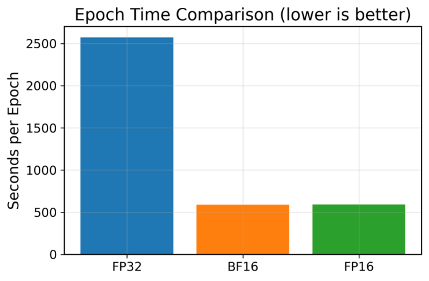
  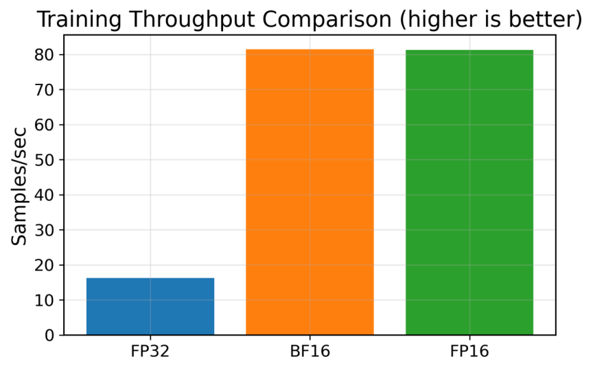
  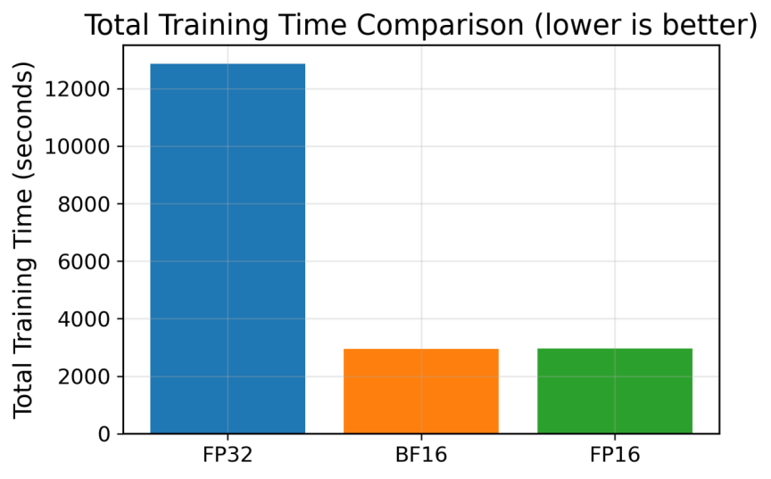
</p>

#### 🔹 Memory Comparison
<p align="center">
  
</p>

- **Parallel Training**  
  - **DDP** achieved better speedup and lower memory overhead on mid-scale GPUs  
  - **FSDP** enabled full model sharding but with higher communication cost  
  - Recommendation: DDP is more efficient for 4–8 GPU setups, while FSDP is beneficial for larger clusters  

#### 🔹 GPU Scaling (DDP)
<p align="center">
  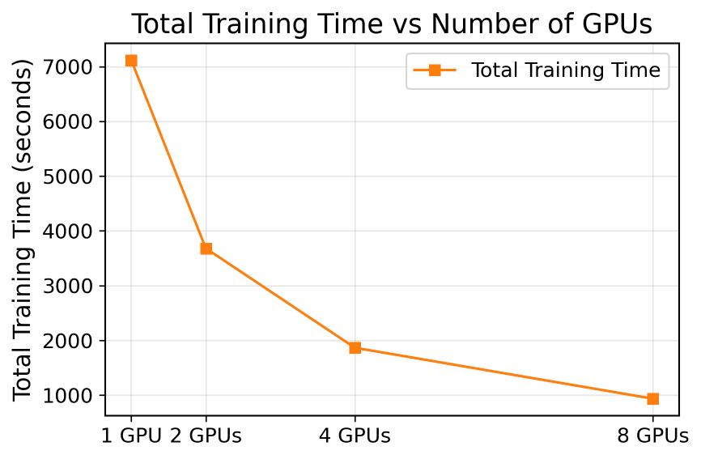
  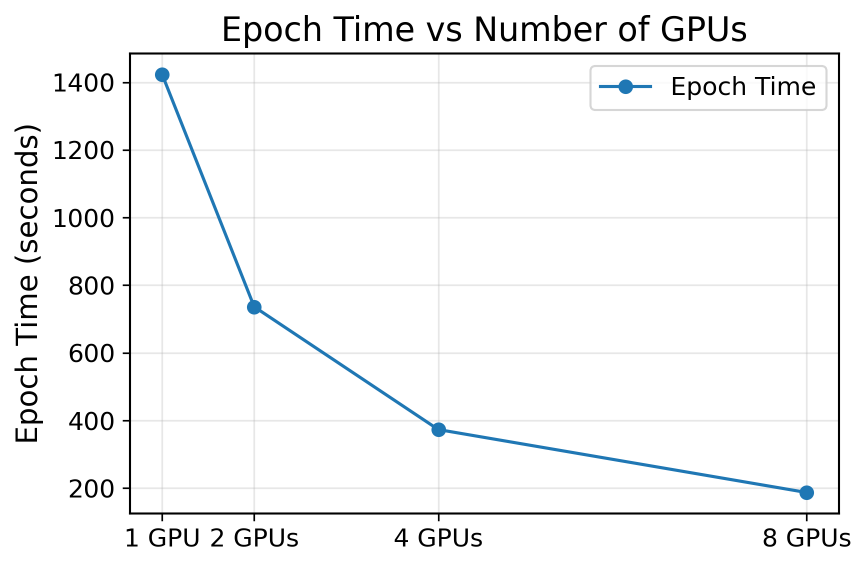
  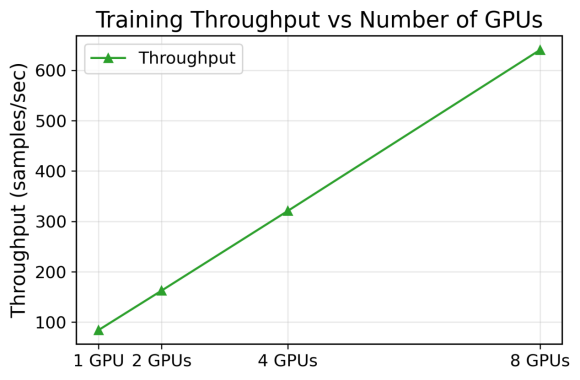
  
</p>
</p>

#### 🔹 GPU Scaling (FSDP)
<p align="center">
  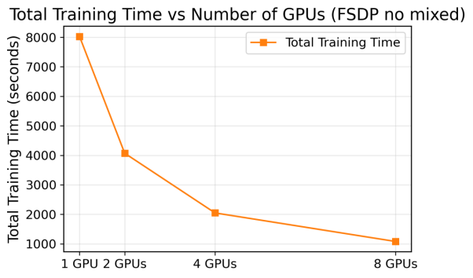
  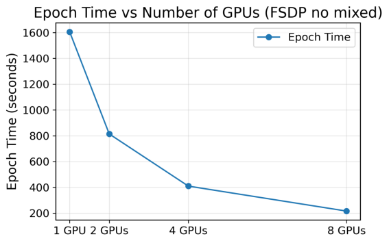
  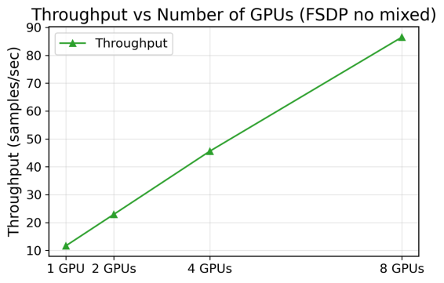
  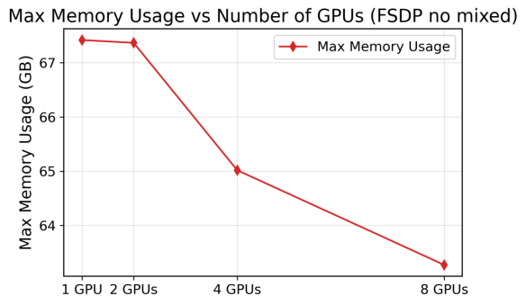
</p>

#### 🔹 DDP V.S. FSDP
<p align="center">
  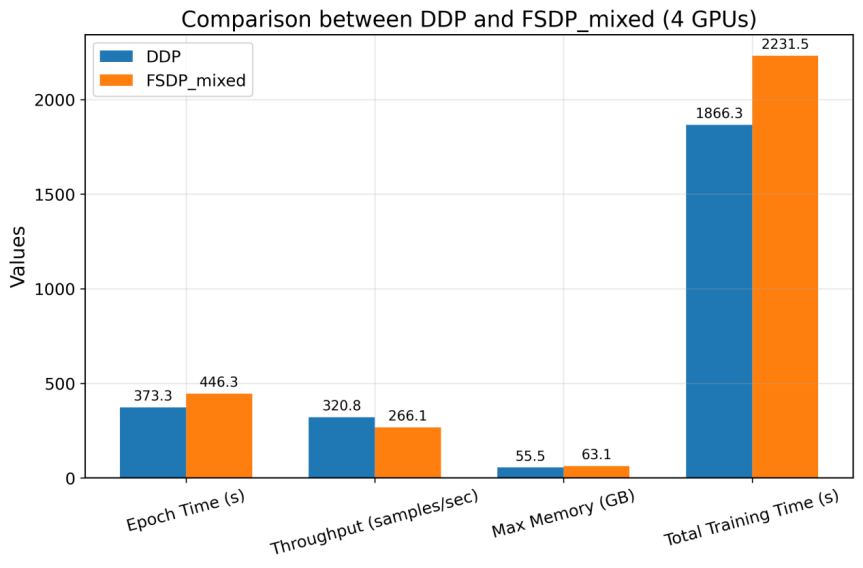
</p>

- **Data Processing**  
  - Tokenization with **Dask + SLURM** reduced preprocessing time for the 3M-sample OpenOrca dataset from 80 minutes to 36 minutes  

---

For more detailed results and analysis, please refer to the [📄 Project Report (PDF)](docs/Project_Report.pdf).

## 📄 License
This project is licensed under the [MIT License](./LICENSE).